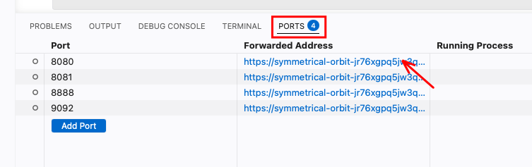

# Streaming Sandbox

A pre-built environment for the streaming chapter of the DENG course. You
don't install anything on your laptop — everything runs in **GitHub
Codespaces** (a development computer in the browser, free for students).

## What you get

When you open this folder in a Codespace, four programs start automatically
inside the cloud computer:

| Program           | Web address you'll use   | What it does                                              |
|-------------------|--------------------------|-----------------------------------------------------------|
| **Redpanda**      | (no UI, port `9092`)     | The "post office" — stores streams of messages (topics)   |
| **Redpanda Console** | open port **`8080`**  | Web page to look inside topics and read messages          |
| **Flink**         | open port **`8081`**     | The "calculator" — runs queries on streaming data         |
| **Dinky**         | open port **`8888`**     | Web page to write SQL queries and send them to Flink      |

A fifth program, **Redpanda Connect**, is available on demand. The
exercises tell you when to start it.

## Step 1 — Open the Codespace

1. On the GitHub repo page, click the green **Code** button.
2. Choose the **Codespaces** tab → **Create codespace on main**.
3. Wait ~3–5 minutes the first time. You'll see Visual Studio Code in your
   browser. Subsequent starts are much faster.

> 💡 **Stop it when done.** Codespaces are free for ~30 hours/month. Closing
> the browser tab does *not* stop billing — go to *github.com/codespaces*
> and click *Stop* on yours.

## Step 2 — Open the web pages

At the bottom of VS Code, click the **PORTS** tab. You'll see a list:

| Port | Label              | Click on this to open |
|------|--------------------|-----------------------|
| 8080 | Redpanda Console   | the message viewer    |
| 8081 | Flink Web UI       | Flink's status page   |
| 8888 | Dinky              | the SQL editor        |

Hover any row → click the small **globe icon** ("Open in Browser") or the
**magnifier icon** ("Preview in Editor"). Both work.




## Step 3 — Run the smoke test

Open [01_setup/smoke_test.ipynb](01_setup/smoke_test.ipynb) and run all
cells. If everything prints "OK", you're ready for the exercises.
Detailed walk-through and troubleshooting in
[01_setup/README.md](01_setup/README.md).

## What's where

- [01_setup/](01_setup/) — kernel selection, smoke test, Dinky guide.
  **Start here.**
- [02_demo/](02_demo/) — minimal working notebooks for producer and consumer
- [03_exercise/](03_exercise/) — six progressive Kafka notebooks
  (`exercise_01_produce_single` → `exercise_06_consume_aggregate`) plus
  the Flink SQL track (`flink_exercises.md`)
- [04_solution/](04_solution/) — reference answers for every exercise
- [docker-compose.yml](docker-compose.yml) — defines all the running programs
- [pyproject.toml](pyproject.toml) — Python tool list (kafka client +
  notebook kernel)
- [flink/Dockerfile](flink/Dockerfile) — recipe for the Flink image (with
  the Kafka connector pre-installed)
- [dinky/Dockerfile](dinky/Dockerfile) — recipe for the Dinky image (with
  English UI and the Kafka connector)
- [examples/producer.py](examples/producer.py) — Python script that makes
  fake clicks
- [examples/consumer.py](examples/consumer.py) — Python script that prints
  messages from a topic
- [examples/flink_clicks.sql](examples/flink_clicks.sql) — Flink SQL for the
  `clicks` topic

## Troubleshooting

**"docker: command not found"** — the codespace was built before docker was
added. Run *Codespaces: Rebuild Container* from the command palette (`F1`).

**Dinky shows Chinese text** — clear browser localStorage for the Dinky tab
or open it in an incognito window. The container patches the language on
first start, but a cached old session can override it.

**A port shows the wrong label** — same fix: rebuild the container so the
new `portsAttributes` from `.devcontainer/devcontainer.json` take effect.

**Flink job fails with "topic not found"** — create the topic first:
`rpk topic create <name> -X brokers=redpanda:29092`.

## Running locally (without Codespaces)

If you have Docker on your laptop and want to skip Codespaces:

```bash
docker compose -f streaming/docker-compose.yml up -d
cd streaming && uv sync
KAFKA_BROKERS=localhost:9092 uv run examples/producer.py
```

Open the same web addresses on `localhost`: <http://localhost:8080>,
<http://localhost:8081>, <http://localhost:8888>.
